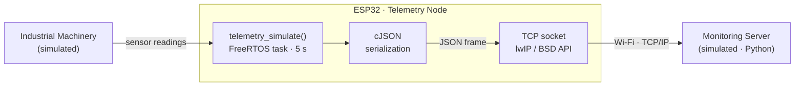
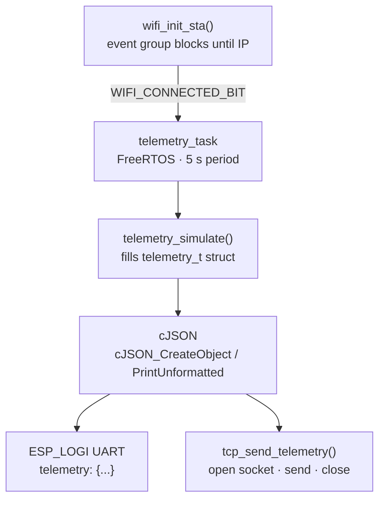
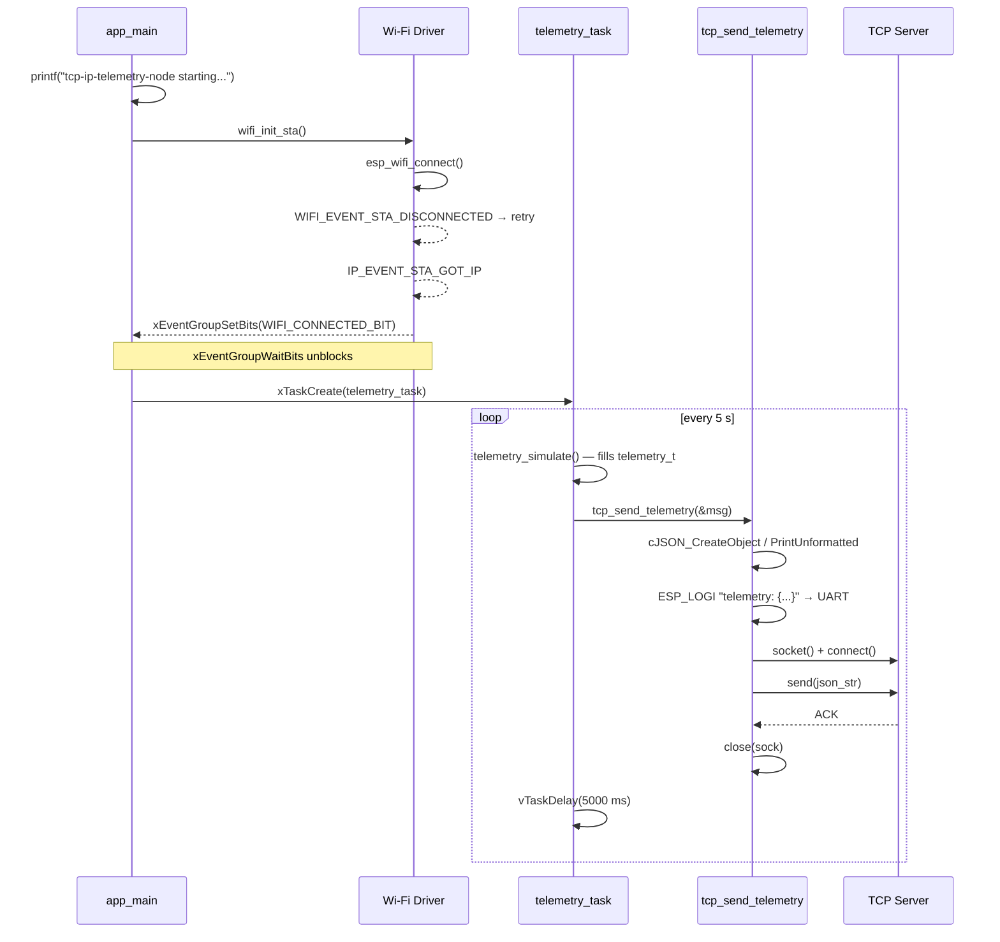
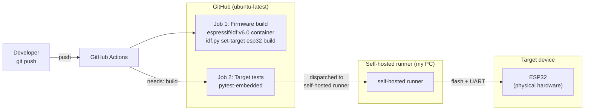

# TCP/IP Telemetry Node for Industrial Machinery

[](https://github.com/miguel-sergio/tcp-ip-telemetry-node/actions/workflows/ci.yml)

> **Step-by-step build guide** (milestones, design decisions, interview angles): [guide.md](guide.md)



## Overview

This is a **proof of concept** for a telemetry bridge node connecting industrial machinery to a monitoring server over Wi-Fi. Both endpoints are simulated: the machine side by `telemetry_simulate()` and the server side by a minimal Python TCP listener. The focus of the project is the node itself: the transport layer, serialization protocol, and communication reliability.

- Simulates machine sensor data (temperature, vibration, state, fault code) using `esp_timer`.
- Serializes each frame into **JSON** with **cJSON** and transmits over a **TCP socket** every 5 seconds.
- Manages the Wi-Fi connection in **station mode** using **FreeRTOS** event groups for synchronization.
- Runs the telemetry loop as a **FreeRTOS task**.
- Validates firmware behavior on physical hardware using **pytest-embedded** over UART.
- Builds and runs hardware-in-the-loop tests automatically on every push with **GitHub Actions**.

## Hardware

| Component | Details |
|-----------|---------|
| MCU | ESP32 |
| Board | ESP32 DevKitC or compatible |
| Connectivity | Wi-Fi 802.11 b/g/n |
| Host interface | USB-to-UART |

## Internal Architecture



## Runtime Flow

One complete boot-to-delivery cycle:



## Telemetry Protocol

Each frame is a single-line JSON object sent over TCP:

```json
{
  "machine_id": "NODE_01",
  "state": 1,
  "temp": 72.45,
  "vibration": 0.123,
  "fault_code": 0,
  "uptime": 3600,
  "ts": 3600000
}
```

| Field | Type | Description |
|-------|------|-------------|
| `machine_id` | string | Node identifier |
| `state` | int | 0 = IDLE, 1 = RUNNING, 2 = FAULT |
| `temp` | float | Temperature in °C |
| `vibration` | float | Vibration level in g |
| `fault_code` | int | Active fault code (0 = none) |
| `uptime` | int | Seconds since boot |
| `ts` | int | Milliseconds since boot |

## Design Decisions

- FreeRTOS task isolates the telemetry loop from the Wi-Fi init sequence.
- Event group (`WIFI_CONNECTED_BIT`) blocks the task until the network is ready, avoiding busy-wait polling.
- cJSON handles serialization cleanly without manual string formatting.
- Credentials are stored in a gitignored `sdkconfig.defaults` via **Kconfig**, never hardcoded.
- pytest-embedded validates firmware behavior over UART, keeping tests independent of TCP server availability.

## Project Structure

```
├── main/
│   ├── main.c                 # Entry point: Wi-Fi init + telemetry task
│   ├── wifi.c / wifi.h        # Wi-Fi STA mode with event group sync
│   ├── telemetry.c / .h       # telemetry_t struct, telemetry_simulate()
│   ├── tcp_client.c / .h      # cJSON serialization + TCP send
│   ├── Kconfig.projbuild      # CONFIG_WIFI_SSID / CONFIG_WIFI_PASSWORD
│   └── CMakeLists.txt
├── server/
│   ├── server.py              # TCP server, parses and logs JSON frames
│   └── requirements.txt
├── pytest_telemetry_node.py   # pytest-embedded target tests (5 test cases)
├── sdkconfig.defaults.example # Credential template (committed)
├── sdkconfig.defaults         # Real credentials (gitignored)
├── sdkconfig.ci               # CI overrides
├── CMakeLists.txt
└── .github/workflows/ci.yml
```

## Build

### Prerequisites

- [ESP-IDF v6.0](https://docs.espressif.com/projects/esp-idf/en/v6.0/esp32/get-started/)
- Target: `esp32`

### Configure credentials

```bash
cp sdkconfig.defaults.example sdkconfig.defaults
# Edit sdkconfig.defaults with your Wi-Fi SSID and password
```

### Firmware

```bash
idf.py set-target esp32 build
idf.py flash
```

### Run the TCP server

```bash
python server/server.py
```

The server listens on `0.0.0.0:5001` and logs each received frame:

```
Listening on port 5001...
[192.168.1.139] id=NODE_01 state=1 temp=71.85 vibration=0.071 fault=0 uptime=3s
[192.168.1.139] id=NODE_01 state=1 temp=72.25 vibration=0.104 fault=0 uptime=8s
```

## Testing

Target tests run on physical ESP32 hardware via UART using pytest-embedded:

```bash
pytest pytest_telemetry_node.py --target esp32 --embedded-services esp,idf -v
```

| Test | Validates |
|------|-----------|
| `test_boot_message` | Firmware starts and prints banner |
| `test_wifi_connects` | Device connects to AP and obtains IP |
| `test_telemetry_is_sent` | At least one telemetry frame is serialized |
| `test_telemetry_json_fields` | JSON contains all required fields |
| `test_telemetry_json_values` | Field values are within expected ranges |

## CI Pipeline

Every push triggers two jobs:



| Job | Runner | What it checks |
|-----|--------|---------------|
| Firmware build | `ubuntu-latest` + `espressif/idf:v6.0` | Firmware compiles cleanly |
| Target tests | `self-hosted` + `esp32` | pytest-embedded tests pass on hardware |

The target tests job requires a self-hosted runner with an ESP32 connected via USB.
See [GitHub Actions self-hosted runner docs](https://docs.github.com/en/actions/hosting-your-own-runners) for setup instructions.
